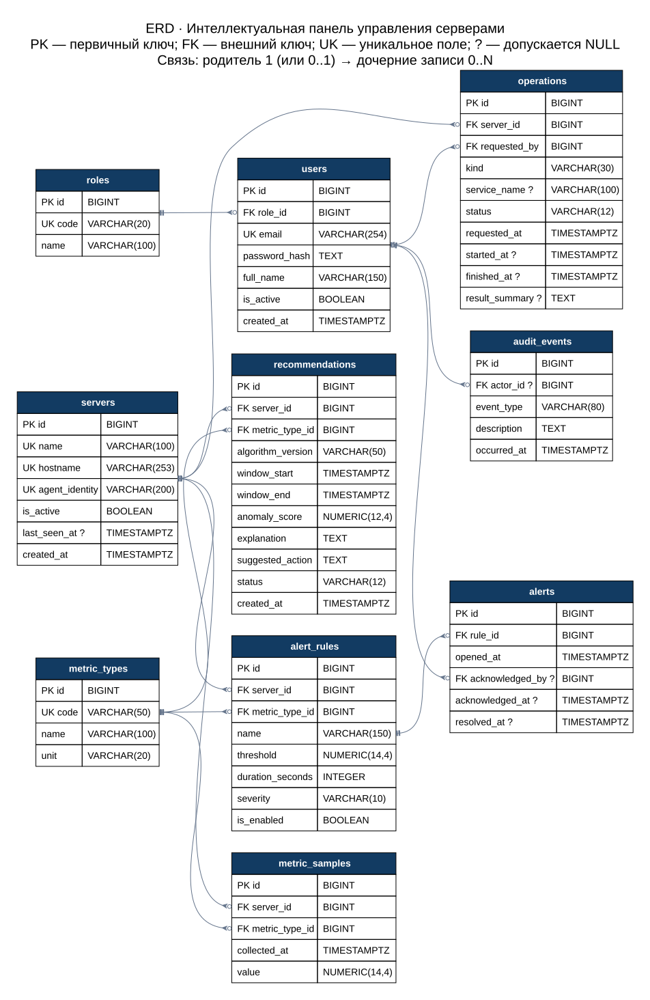

# Лабораторная работа № 1

**Дисциплина:** Разработка серверных приложений.

**Тема занятия:** Проектирование архитектуры серверного приложения и предметной области.

**Тема проекта:** Интеллектуальная панель управления серверами.

## 1. Назначение проекта

Система предназначена для централизованного наблюдения за Linux-серверами и выполнения типовых эксплуатационных действий из веб-интерфейса. Она собирает показатели CPU, оперативной памяти, корневого дискового раздела и средней нагрузки, отображает историю, регистрирует превышения порогов и формирует объяснимые рекомендации по обнаруженным аномалиям.

Цель — сократить время обнаружения проблем и помочь оператору выбрать действие на основании измерений. Например, панель обнаруживает необычный рост использования памяти, показывает отклонение от обычного уровня и предлагает собрать диагностику службы.

Это архитектурный проект будущего приложения. В лабораторной подготовлены модель предметной области, сценарии, C4 Container, ERD и SQL-схема; клиент, API и агент пока не реализованы.

### Границы и допущения

- Одна организация и общий парк серверов; разграничение доступа выполняется по ролям, без отдельных прав на каждый сервер.
- Пользователь имеет ровно одну роль. Учётные записи создаёт администратор, публичной регистрации нет.
- На каждом сервере установлен доверенный агент. Он сам устанавливает соединение с API, поэтому входящий доступ к серверу со стороны панели не требуется.
- Агент передаёт по одному значению каждого вида метрики раз в 30 секунд. В MVP отслеживается только корневой дисковый раздел; детализация по дискам и процессам потребует расширения модели.
- При отсутствии сообщений более 90 секунд интерфейс показывает сервер как недоступный. Это вычисляемый признак по `last_seen_at`, а не отдельное поле состояния.
- Интеллектуальная часть использует статистический анализ и объяснимые правила. Она не выполняет команды автоматически.
- Поддержаны сбор диагностики и перезапуск службы из разрешённого списка. Произвольный ввод shell-команд, биллинг и создание виртуальных машин выходят за границы проекта.
- Уведомления отображаются внутри панели; внешние почтовые сервисы в MVP не нужны.

## 2. Ролевая модель

| Возможность | Наблюдатель (`viewer`) | Оператор (`operator`) | Администратор (`admin`) |
|---|:---:|:---:|:---:|
| Вход, просмотр серверов и графиков | Да | Да | Да |
| Просмотр инцидентов и рекомендаций | Да | Да | Да |
| Принятие инцидента в работу | Нет | Да | Да |
| Рассмотрение/отклонение рекомендации | Нет | Да | Да |
| Сбор диагностики и перезапуск разрешённой службы | Нет | Да | Да |
| Просмотр истории операций | Да | Да | Да |
| Регистрация и отключение серверов | Нет | Нет | Да |
| Создание и отключение пороговых правил | Нет | Нет | Да |
| Управление пользователями и ролями | Нет | Нет | Да |
| Просмотр полного журнала аудита | Нет | Нет | Да |

Backend проверяет роль при каждом запросе. Скрытие кнопки в интерфейсе не заменяет проверку доступа. Отключение пользователя прекращает доступ при следующем запросе; система не позволяет отключить или понизить роль последнего активного администратора. Последняя проверка выполняется транзакционно в API.

## 3. Сценарии использования (Use Cases)

| ID | Сценарий и актор | Предусловия | Основной поток | Результат и альтернативы |
|---|---|---|---|---|
| UC-01 | Вход — любая роль | Учётная запись активна | Пользователь вводит email и пароль; API проверяет хеш и создаёт сессию | Открывается панель; неверные данные или блокировка приводят к отказу без раскрытия существования учётной записи |
| UC-02 | Просмотр состояния — любая роль | Выполнен вход | Пользователь выбирает сервер и интервал; API возвращает метрики и время последнего сообщения | Отображаются графики, инциденты и рекомендации; при отсутствии измерений выводится «Нет данных», при устаревших данных — время последнего обновления |
| UC-03 | Регистрация сервера — администратор | Подготовлен агент с клиентским сертификатом | Администратор задаёт имя, DNS-имя и идентификатор агента; агент отправляет первые метрики | Создан сервер и начат мониторинг; повторное имя/идентификатор отклоняется, неизвестный сертификат не допускается |
| UC-04 | Настройка правила — администратор | Сервер и вид метрики существуют | Задаются порог, длительность и важность; система проверяет диапазоны и сохраняет правило | Правило участвует в следующей проверке; некорректные параметры не сохраняются |
| UC-05 | Обработка инцидента — оператор или администратор | Есть открытый инцидент | Пользователь изучает график, принимает инцидент в работу и при необходимости запускает диагностику | Фиксируются пользователь и время принятия; повторное принятие возвращает текущее состояние; устранение фиксируется системой после нормализации метрики |
| UC-06 | Рассмотрение рекомендации — оператор или администратор | Анализ сформировал рекомендацию | Пользователь читает обоснование, открывает историю метрики и отмечает рекомендацию рассмотренной либо отклонённой | Статус сохранён; отсутствие достаточной истории не подменяется выдуманной рекомендацией |
| UC-07 | Выполнение операции — оператор или администратор | Сервер активен и доступен; служба входит в разрешённый список | Пользователь выбирает действие и подтверждает перезапуск в интерфейсе; API создаёт операцию; обработчик готовит её к выдаче; агент получает и исполняет команду | Сохранены состояние и результат; недоступность даёт отказ/ошибку, обрыв после выдачи команды — `unknown`, без автоматического повторного перезапуска |
| UC-08 | Управление пользователями — администратор | Выполнен вход с ролью admin | Администратор создаёт пользователя, назначает роль либо отключает запись | Изменение записано в аудит; повторный email и отключение последнего администратора отклоняются |
| UC-09 | Просмотр аудита — администратор | В системе есть события | Администратор фильтрует события по пользователю и времени | Отображается история действий; изменение записей аудита через API не предусмотрено |

### Автоматические сценарии

**Приём метрик.** Агент → API: проверка mTLS, соответствия `agent_identity` серверу, единиц и диапазонов. API записывает измерения и обновляет `last_seen_at`. Повтор пакета не создаёт дублей благодаря уникальности `(server_id, metric_type_id, collected_at)`. Для процентных метрик API допускает только 0–100; время не должно быть более чем на 60 секунд в будущем. Нижняя граница истории при загрузке — 30 дней.

**Пороговый контроль.** Обработчик запускается раз в 30 секунд. Открывает инцидент, если все последовательные измерения строго выше порога на интервале не меньше `duration_seconds`, а разрыв между соседними измерениями не превышает 60 секунд. Пропуск данных прерывает интервал и не считается нормализацией. По правилу допускается только один незакрытый инцидент. Первое новое значение не выше порога закрывает его; принятие оператором не закрывает инцидент. Если правило отключено, новые инциденты не создаются, а существующий закрывается при следующем проходе с записью причины в аудит. Использованное правило не редактируется: для изменения порога старое отключают и создают новое с другим именем. Это сохраняет смысл исторических инцидентов.

**Анализ аномалий.** Раз в пять минут обработчик берёт последнее измерение `x` и предыдущие 60 минут этой метрики на этом сервере, исключая `x`. Требуются не менее 100 точек истории, свежее последнее измерение и отсутствие разрывов более 60 секунд. Рассчитываются среднее `μ`, стандартное отклонение `σ` и `z = |x − μ| / σ`. При `σ = 0` статистическая рекомендация не создаётся, но пороговые правила продолжают работать. При `z ≥ 3` сохраняется рекомендация с версией алгоритма, окном, оценкой и объяснением. Это эвристика, а не установленная причина сбоя или вероятность неисправности.

Пример: среднее использование RAM — 50%, стандартное отклонение — 5 процентных пунктов, последнее значение — 80%. Тогда `z = 6`; панель предлагает собрать диагностику памяти. При необычном снижении нагрузки формируется иной текст: проверить доступность службы и изменение трафика. Текст зависит от вида метрики и направления отклонения. Уникальный ключ окна защищает от дублей при повторном запуске обработчика. Для устранения проблемы пользователь отдельно создаёт операцию UC-07.

## 4. Архитектура C4 Container (уровень 2)

[Редактируемый исходник Mermaid](diagrams/c4-containers.mmd)

Диаграмма показывает людей, границу системы, приложения и хранилище, их ответственность, технологии и протоколы. Под контейнером здесь понимается приложение или хранилище, а не обязательно Docker-контейнер, согласно [официальному описанию C4 Container](https://c4model.com/diagrams/container).

| Контейнер | Технология | Ответственность |
|---|---|---|
| Веб-клиент | React, TypeScript | Графики, таблицы, формы настройки, подтверждение операций; обращается только к API |
| Backend API | Python, FastAPI | Аутентификация, права, проверка данных, приём метрик и результатов, создание операций |
| Фоновый обработчик | Python, отдельный процесс | Пороговые проверки, анализ истории, подготовка команд и обработка тайм-аутов |
| База данных | PostgreSQL | Постоянные данные и транзакционная очередь операций |

Управляемые серверы с агентами показаны как внешняя система: панель обращается к их протоколу управления, а сами серверы находятся за границей приложения. Инициатор сетевых обращений — агент: он передаёт метрики и каждые пять секунд запрашивает назначенную команду. Все обращения агентов защищены mTLS; идентификатор сертификата определяет сервер. Сертификаты и ключи выдаются и хранятся инфраструктурой вне бизнес-таблиц.

Redis/отдельный брокер в MVP не используется: очередь хранится в `operations`, поэтому запись запроса и постановка в очередь атомарны. Обработчик выбирает `queued` через `FOR UPDATE SKIP LOCKED`, проверяет доступность и разрешённую команду, затем переводит запись в `running`; здесь `started_at` означает начало обработки в панели. Агент получает `running`-операцию через API. Результат переводит её в `succeeded` или `failed`. По истечении пяти минут без результата устанавливается `unknown` и записывается событие аудита. Пользователь сначала проверяет фактическое состояние сервера, затем при необходимости создаёт новую операцию.

Агент ведёт постоянный локальный журнал идентификаторов операций и не исполняет повторно уже принятую команду. После сбоя между принятием и фиксацией результата агент сообщает неопределённость; гарантировать выполнение «ровно один раз» для внешнего действия нельзя. API принимает результат только от агента соответствующего сервера. Поздний достоверный результат может уточнить `unknown` до `succeeded`/`failed` с записью в аудит.

Для MVP достаточно одного фонового процесса. Состояния операций и результаты анализа сохраняются в PostgreSQL, поэтому перезапуск процесса не теряет очередь. Записи метрик хранятся 30 дней и удаляются небольшими пакетами; инциденты, рекомендации и аудит сохраняются. Объяснение рекомендации остаётся доступным после удаления исходных измерений.

Пароли хранятся как Argon2id-хеши. Сессии реализуются подписанными краткоживущими cookie с `HttpOnly`, `Secure`, `SameSite`; изменяющие запросы защищаются от CSRF. API повторно проверяет активность и роль пользователя по базе. Агент выполняет только команды из локального разрешённого списка, не интерпретируя произвольный shell-текст. Удаление пользователей и серверов заменяется деактивацией, чтобы сохранить историю.

## 5. Модель данных и ER-диаграмма

[Изображение в полном размере](diagrams/erd.svg) · [Исходник Graphviz](diagrams/erd.dot) · [Исполняемая SQL-схема](db/schema.sql)

Модель содержит **10 сущностей**. Диаграмма показывает все поля, типы, первичные и внешние ключи и кардинальности в нотации «воронья лапка». Составные уникальные ограничения, CHECK и индексы приведены ниже и полностью заданы в SQL. `?` означает допустимый NULL; `UK` у поля — индивидуальную уникальность. Все первичные ключи имеют тип BIGINT и генерируются базой. Временные поля имеют тип TIMESTAMPTZ; обмен с API ведётся в UTC.

| Родитель → дочерняя сущность | Кардинальность | Внешний ключ и смысл |
|---|---|---|
| roles → users | 1 → 0..N | `users.role_id`: у пользователя ровно одна роль |
| servers → metric_samples | 1 → 0..N | `metric_samples.server_id`: источник измерения |
| metric_types → metric_samples | 1 → 0..N | `metric_samples.metric_type_id`: вид измерения |
| servers → alert_rules | 1 → 0..N | `alert_rules.server_id`: сервер правила |
| metric_types → alert_rules | 1 → 0..N | `alert_rules.metric_type_id`: контролируемая метрика |
| alert_rules → alerts | 1 → 0..N | `alerts.rule_id`: история срабатываний |
| users → alerts | 0..1 → 0..N | `alerts.acknowledged_by`: инцидент может ещё не быть принят |
| servers → recommendations | 1 → 0..N | `recommendations.server_id`: адресат рекомендации |
| metric_types → recommendations | 1 → 0..N | `recommendations.metric_type_id`: основание анализа |
| servers → operations | 1 → 0..N | `operations.server_id`: цель команды |
| users → operations | 1 → 0..N | `operations.requested_by`: обязательный инициатор |
| users → audit_events | 0..1 → 0..N | `audit_events.actor_id`: NULL у системных событий |

Связь серверов и видов метрик имеет характер N:M и реализована сущностью измерений: для одной пары хранится множество точек с разным временем. Отдельная прямая связь N:M без таблицы в реляционной модели не используется.

## 6. Словарь данных

В таблицах ниже указаны SQL-определения полей. `PRIMARY KEY` подразумевает `NOT NULL` и уникальность. Если нет `NOT NULL` или `PRIMARY KEY`, поле может быть NULL. Все внешние ключи используют стандартное `ON DELETE NO ACTION`: удаление связанной родительской записи блокируется.

### 6.1. `roles`

| Поле | Тип и ограничения | Назначение |
|---|---|---|
| `id` | `BIGINT GENERATED ALWAYS AS IDENTITY PRIMARY KEY` | Идентификатор роли |
| `code` | `VARCHAR(20) NOT NULL UNIQUE CHECK (code IN ('admin','operator','viewer'))` | Код роли |
| `name` | `VARCHAR(100) NOT NULL` | Название роли |

### 6.2. `users`

| Поле | Тип и ограничения | Назначение |
|---|---|---|
| `id` | `BIGINT GENERATED ALWAYS AS IDENTITY PRIMARY KEY` | Идентификатор пользователя |
| `role_id` | `BIGINT NOT NULL REFERENCES roles(id)` | Роль пользователя |
| `email` | `VARCHAR(254) NOT NULL UNIQUE CHECK (email = lower(email))` | Логин; email приводится к нижнему регистру |
| `password_hash` | `TEXT NOT NULL` | Хеш пароля Argon2id; исходный пароль не хранится |
| `full_name` | `VARCHAR(150) NOT NULL` | Имя пользователя |
| `is_active` | `BOOLEAN NOT NULL DEFAULT TRUE` | Разрешён ли вход |
| `created_at` | `TIMESTAMPTZ NOT NULL DEFAULT now()` | Время создания |

### 6.3. `servers`

| Поле | Тип и ограничения | Назначение |
|---|---|---|
| `id` | `BIGINT GENERATED ALWAYS AS IDENTITY PRIMARY KEY` | Идентификатор сервера |
| `name` | `VARCHAR(100) NOT NULL UNIQUE` | Название в панели |
| `hostname` | `VARCHAR(253) NOT NULL UNIQUE` | DNS-имя сервера в нижнем регистре |
| `agent_identity` | `VARCHAR(200) NOT NULL UNIQUE` | Идентификатор агента из клиентского сертификата; не секрет |
| `is_active` | `BOOLEAN NOT NULL DEFAULT TRUE` | Участвует ли сервер в мониторинге |
| `last_seen_at` | `TIMESTAMPTZ` | Время последнего сообщения; NULL до первого подключения |
| `created_at` | `TIMESTAMPTZ NOT NULL DEFAULT now()` | Время регистрации |

### 6.4. `metric_types`

| Поле | Тип и ограничения | Назначение |
|---|---|---|
| `id` | `BIGINT GENERATED ALWAYS AS IDENTITY PRIMARY KEY` | Идентификатор вида метрики |
| `code` | `VARCHAR(50) NOT NULL UNIQUE` | Код: cpu_usage, memory_usage, disk_usage, load_average |
| `name` | `VARCHAR(100) NOT NULL` | Название метрики |
| `unit` | `VARCHAR(20) NOT NULL` | Единица измерения: percent или ratio |

### 6.5. `metric_samples`

| Поле | Тип и ограничения | Назначение |
|---|---|---|
| `id` | `BIGINT GENERATED ALWAYS AS IDENTITY PRIMARY KEY` | Идентификатор измерения |
| `server_id` | `BIGINT NOT NULL REFERENCES servers(id)` | Сервер-источник |
| `metric_type_id` | `BIGINT NOT NULL REFERENCES metric_types(id)` | Вид метрики |
| `collected_at` | `TIMESTAMPTZ NOT NULL` | Время измерения на сервере |
| `value` | `NUMERIC(14,4) NOT NULL CHECK (value >= 0 AND value < 'Infinity'::numeric)` | Измеренное значение; только конечное неотрицательное число |

Ограничения таблицы:

- `UNIQUE (server_id, metric_type_id, collected_at)`.

### 6.6. `alert_rules`

| Поле | Тип и ограничения | Назначение |
|---|---|---|
| `id` | `BIGINT GENERATED ALWAYS AS IDENTITY PRIMARY KEY` | Идентификатор правила |
| `server_id` | `BIGINT NOT NULL REFERENCES servers(id)` | Сервер, для которого задано правило |
| `metric_type_id` | `BIGINT NOT NULL REFERENCES metric_types(id)` | Контролируемая метрика |
| `name` | `VARCHAR(150) NOT NULL` | Название правила |
| `threshold` | `NUMERIC(14,4) NOT NULL CHECK (threshold >= 0 AND threshold < 'Infinity'::numeric)` | Верхний порог: правило проверяет value > threshold |
| `duration_seconds` | `INTEGER NOT NULL CHECK (duration_seconds BETWEEN 30 AND 86400)` | Длительность непрерывного превышения |
| `severity` | `VARCHAR(10) NOT NULL CHECK (severity IN ('warning','critical'))` | Важность |
| `is_enabled` | `BOOLEAN NOT NULL DEFAULT TRUE` | Включено ли правило |

Ограничения таблицы:

- `UNIQUE (server_id, name)`.

### 6.7. `alerts`

| Поле | Тип и ограничения | Назначение |
|---|---|---|
| `id` | `BIGINT GENERATED ALWAYS AS IDENTITY PRIMARY KEY` | Идентификатор инцидента |
| `rule_id` | `BIGINT NOT NULL REFERENCES alert_rules(id)` | Сработавшее правило; сервер и метрика определяются через него |
| `opened_at` | `TIMESTAMPTZ NOT NULL DEFAULT now()` | Начало инцидента |
| `acknowledged_by` | `BIGINT REFERENCES users(id)` | Кто принял инцидент; NULL до принятия |
| `acknowledged_at` | `TIMESTAMPTZ` | Когда принят; NULL до принятия |
| `resolved_at` | `TIMESTAMPTZ` | Время устранения; NULL пока инцидент открыт |

Ограничения таблицы:

- `CHECK ((acknowledged_by IS NULL) = (acknowledged_at IS NULL))`.
- `CHECK (acknowledged_at IS NULL OR acknowledged_at >= opened_at)`.
- `CHECK (resolved_at IS NULL OR resolved_at >= opened_at)`.

### 6.8. `recommendations`

| Поле | Тип и ограничения | Назначение |
|---|---|---|
| `id` | `BIGINT GENERATED ALWAYS AS IDENTITY PRIMARY KEY` | Идентификатор рекомендации |
| `server_id` | `BIGINT NOT NULL REFERENCES servers(id)` | Сервер, к которому относится рекомендация |
| `metric_type_id` | `BIGINT NOT NULL REFERENCES metric_types(id)` | Метрика, на основании которой сделан вывод |
| `algorithm_version` | `VARCHAR(50) NOT NULL` | Версия алгоритма для воспроизводимости |
| `window_start` | `TIMESTAMPTZ NOT NULL` | Начало проанализированного интервала |
| `window_end` | `TIMESTAMPTZ NOT NULL` | Конец проанализированного интервала |
| `anomaly_score` | `NUMERIC(12,4) NOT NULL CHECK (anomaly_score >= 0 AND anomaly_score < 'Infinity'::numeric)` | Абсолютный z-score; не вероятность |
| `explanation` | `TEXT NOT NULL` | Объяснение с наблюдаемым значением, средним и отклонением |
| `suggested_action` | `TEXT NOT NULL` | Предлагаемое действие для пользователя |
| `status` | `VARCHAR(12) NOT NULL DEFAULT 'new' CHECK (status IN ('new','reviewed','dismissed'))` | Состояние рассмотрения |
| `created_at` | `TIMESTAMPTZ NOT NULL DEFAULT now()` | Время формирования |

Ограничения таблицы:

- `CHECK (window_end > window_start)`.
- `UNIQUE (server_id, metric_type_id, algorithm_version, window_end)`.

### 6.9. `operations`

| Поле | Тип и ограничения | Назначение |
|---|---|---|
| `id` | `BIGINT GENERATED ALWAYS AS IDENTITY PRIMARY KEY` | Идентификатор операции; ключ дедупликации у агента |
| `server_id` | `BIGINT NOT NULL REFERENCES servers(id)` | Целевой сервер |
| `requested_by` | `BIGINT NOT NULL REFERENCES users(id)` | Пользователь, запустивший операцию |
| `kind` | `VARCHAR(30) NOT NULL CHECK (kind IN ('restart_service','collect_diagnostics'))` | Разрешённая команда |
| `service_name` | `VARCHAR(100)` | Имя службы; обязательно только для restart_service |
| `status` | `VARCHAR(12) NOT NULL DEFAULT 'queued' CHECK (status IN ('queued','running','succeeded','failed','unknown'))` | Состояние; unknown — результат после обрыва связи неизвестен |
| `requested_at` | `TIMESTAMPTZ NOT NULL DEFAULT now()` | Время запроса |
| `started_at` | `TIMESTAMPTZ` | Время начала обработки в панели |
| `finished_at` | `TIMESTAMPTZ` | Время завершения либо фиксации неизвестного результата |
| `result_summary` | `TEXT` | Краткий результат без секретов |

Ограничения таблицы:

- `CHECK ((kind = 'restart_service' AND service_name IS NOT NULL AND length(trim(service_name)) > 0) OR (kind = 'collect_diagnostics' AND service_name IS NULL))`.
- `CHECK (started_at IS NULL OR started_at >= requested_at)`.
- `CHECK (finished_at IS NULL OR finished_at >= COALESCE(started_at, requested_at))`.
- `CHECK ((status = 'queued' AND started_at IS NULL AND finished_at IS NULL) OR (status = 'running' AND started_at IS NOT NULL AND finished_at IS NULL) OR (status = 'succeeded' AND started_at IS NOT NULL AND finished_at IS NOT NULL) OR (status IN ('failed','unknown') AND finished_at IS NOT NULL))`.

### 6.10. `audit_events`

| Поле | Тип и ограничения | Назначение |
|---|---|---|
| `id` | `BIGINT GENERATED ALWAYS AS IDENTITY PRIMARY KEY` | Идентификатор записи аудита |
| `actor_id` | `BIGINT REFERENCES users(id)` | Инициатор; NULL для системного события |
| `event_type` | `VARCHAR(80) NOT NULL` | Код события: user.disabled, operation.requested и т. п. |
| `description` | `TEXT NOT NULL` | Самодостаточное описание события без паролей и токенов |
| `occurred_at` | `TIMESTAMPTZ NOT NULL DEFAULT now()` | Время события |

## 7. Нормализация до 3НФ

**Первая нормальная форма.** Каждая строка имеет ключ; поля содержат одно значение. Список метрик или операций не хранится в одной ячейке: каждое измерение и каждое действие — отдельная запись. Текст объяснения является единым документом, а не заменой набора связанных сущностей.

**Вторая нормальная форма.** Неключевые атрибуты зависят от полного кандидатного ключа. Например, в `metric_samples` значение зависит от всей тройки `(server_id, metric_type_id, collected_at)`, а не только от сервера или вида метрики. Название сервера и единица измерения в этой таблице отсутствуют. Это проверено и для альтернативных составных ключей правил и рекомендаций, а не только для искусственных `id`.

**Третья нормальная форма.** Описательные атрибуты не зависят транзитивно от ключа через другие неключевые атрибуты. `role_id` пользователя ссылается на справочник, а название роли хранится только в `roles`. Код, название и единица метрики находятся в `metric_types`. Инцидент содержит только `rule_id`: сервер, метрика и важность доступны через правило и не дублируются. В операции хранится `requested_by`, но не email инициатора.

Основные зависимости: `roles.id → code, name`; `users.id → role_id, email, ...`; `servers.id → name, hostname, ...`; `metric_types.id → code, name, unit`; `(server_id, metric_type_id, collected_at) → metric_samples.value`; `alert_rules.id → server_id, metric_type_id, threshold, ...`; `alerts.id → rule_id, opened_at, ...`; `recommendations.id → server_id, metric_type_id, window_start, window_end, ...`; `operations.id → server_id, requested_by, kind, ...`; `audit_events.id → actor_id, event_type, description, occurred_at`.

Рекомендация — исторический результат конкретного анализа, а её объяснение — снимок обоснования. Единица измерения не определяет название или код метрики: несколько метрик могут измеряться в процентах. Следовательно, хранение единицы рядом с видом метрики не создаёт транзитивной зависимости.

## 8. Ограничения целостности и индексы

PK идентифицируют строки, FK обеспечивают существование связанных записей, NOT NULL задаёт обязательность, UNIQUE исключает дубли, CHECK ограничивает допустимые значения и сочетания полей. PostgreSQL создаёт индексы для PK/UNIQUE, но индексы на ссылающихся полях FK нужно планировать отдельно — см. [документацию PostgreSQL об ограничениях](https://www.postgresql.org/docs/16/ddl-constraints.html).

| Таблица | Индекс | Для чего используется |
|---|---|---|
| users | UNIQUE(email); `idx_users_role(role_id)` | Вход и выборка пользователей роли |
| servers | UNIQUE(name), UNIQUE(hostname), UNIQUE(agent_identity) | Исключение дублей и идентификация агента |
| metric_samples | UNIQUE(server_id, metric_type_id, collected_at) | Идемпотентный приём, график метрики сервера за период; покрывает FK server_id |
| metric_samples | `idx_samples_metric(metric_type_id)` | FK вида метрики |
| alert_rules | UNIQUE(server_id, name); `idx_rules_metric(metric_type_id)` | Правила сервера и оба FK |
| alerts | `uq_alerts_open_rule(rule_id) WHERE resolved_at IS NULL` | Не более одного открытого инцидента на правило |
| alerts | `idx_alerts_rule_time(rule_id, opened_at DESC)`; `idx_alerts_actor(acknowledged_by)` | История срабатываний и FK пользователя |
| recommendations | UNIQUE(server_id, metric_type_id, algorithm_version, window_end) | Защита от повторного анализа одного окна, FK сервера |
| recommendations | `idx_recommendations_metric(metric_type_id)`; `idx_recommendations_status_time(status, created_at DESC)` | FK метрики и список новых рекомендаций |
| operations | `idx_operations_server_time(server_id, requested_at DESC)`; `idx_operations_user(requested_by)` | История команд и оба FK |
| operations | `idx_operations_queue(status, requested_at)` для queued/running | Выборка очереди и поиск зависших операций |
| audit_events | `idx_audit_actor_time(actor_id, occurred_at DESC)`; `idx_audit_time(occurred_at DESC)` | Поиск по инициатору и времени |

Каждый FK покрыт отдельным индексом либо является первым столбцом составного индекса. Префикс `(server_id, metric_type_id)` в индексе измерений позволяет выбирать диапазон времени для конкретной метрики, включая обратный обход для последних значений.

SQL проверяет допустимые роли и состояния, положительную длительность, конечные неотрицательные числовые значения, порядок времени, согласованность принятия инцидента и обязательность имени службы для перезапуска. Бизнес-проверки, требующие обращения к другим строкам или инфраструктуре, выполняет приложение: права, диапазон 0–100 для процентных метрик, неизменность использованного правила, наличие последнего администратора, разрешённый список служб и допустимые переходы состояния. CHECK не используется для имитации таких межтабличных правил.

Изменение бизнес-данных и запись соответствующего события аудита происходят в одной транзакции. При развёртывании сервисной роли приложения для `audit_events` выдаются только INSERT/SELECT; создание технических ролей и GRANT не входят в SQL-схему предметной области. Переходы операции выполняются условным UPDATE по текущему состоянию, чтобы конкурирующие обработчики не перезаписывали завершённый результат.

## 9. Соответствие заданию

| Требование со скриншотов | Результат |
|---|---|
| Название, назначение и основные операции | Разделы 1 и 3 |
| Минимум две роли и Use Cases | Три роли, девять пользовательских сценариев и три автоматических |
| Не менее пяти ключевых сущностей | Десять таблиц; разделы 5–6 |
| C4 Container, уровень 2 | Встроенное изображение в разделе 4; исходник Mermaid и SVG в diagrams |
| ERD в 3НФ с описанием полей и связей | Разделы 5–7; исходник и изображения в diagrams |
| PK, FK, NOT NULL, UNIQUE, CHECK, индексы | Разделы 6 и 8; db/schema.sql |
| README.md и ARCHITECTURE.md в корне | Оба файла подготовлены |
| Сдача ссылкой на Git-репозиторий | [github.com/bendyou/RSP](https://github.com/bendyou/RSP) |
